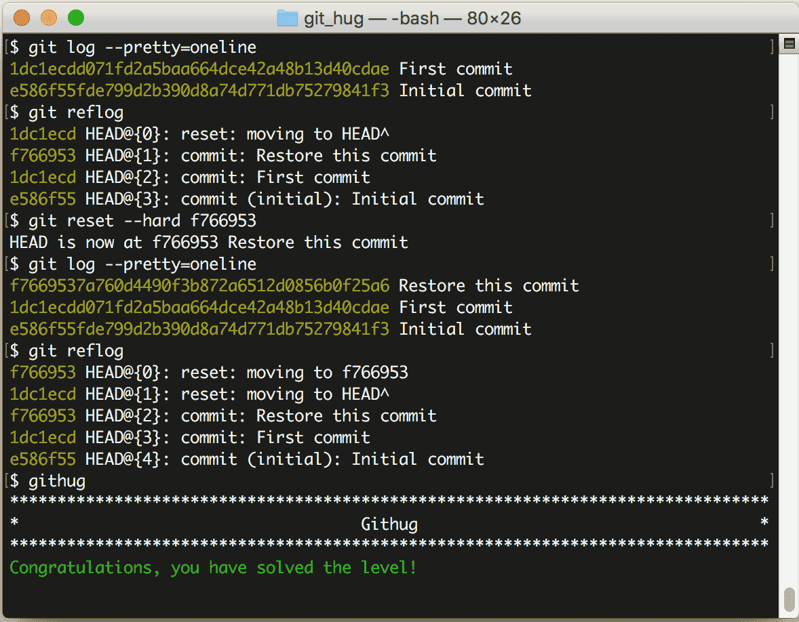

# 第52关 restore

> You decided to delete your latest commit by running `git reset --hard HEAD^`.  (Not a smart thing to do.)  You then change your mind, and want that commit back.  Restore the deleted commit.
> 
> 你决定用 `git reset --hard HEAD^` 删除最后一次提交（一个不太明智的决定），然后你又反悔了，想回退到这条命令之前。请恢复被删除的提交。

我们先查一下提交日志，发现有过2次提交：

```
$ git log --pretty=oneline
1dc1ecdd071fd2a5baa664dce42a48b13d40cdae First commit
e586f55fde799d2b390d8a74d771db75279841f3 Initial commit
```

再看看操作日志：

```
$ git reflog
1dc1ecd HEAD@{0}: reset: moving to HEAD^
f766953 HEAD@{1}: commit: Restore this commit
1dc1ecd HEAD@{2}: commit: First commit
e586f55 HEAD@{3}: commit (initial): Initial commit
```

哦，原来还曾有过第3次提交，不过被 `git reset --hard HEAD^` 删除掉了。`git reset --hard HEAD^` 用于删除最后一次提交，使工作区恢复到上一次提交时的状态，仔细观察上面的操作日志也能发现，其中 "HEAD@{2}" 和 "HEAD@{0}" 的哈希值是一样的。

如果要撤销这条命令本身，也就是恢复到执行这条命令之前的状态，我们可以用下面的命令形式：

```
$ git reset --hard hash-code
```

上面命令中的 hash-code 就是你要恢复到的那次提交的哈希值。在执行此命令之后，提交日志中会增加一条提交日志，操作日志会自动增加一条 "reset: moving to hash-code" 的日志。

第52关过关画面如下：

